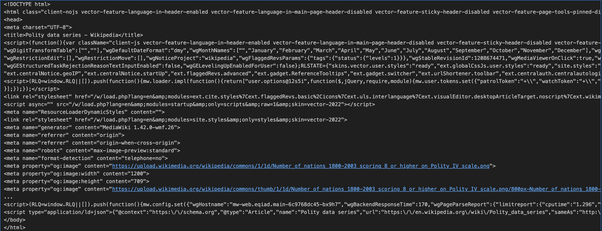

# Wiki-Scraping-Tutorial

## Preface
Recently, I worked on an assignment that required gathering data from diverse sources on the internet. A component of that entailed collecting data from tables embedded within wikipedia articles. As a result, I thought it was a good time to write a simple tutorial on data extraction from wikipedia using the web scraping package [BeautifulSoup](https://www.crummy.com/software/BeautifulSoup/). 

### Keywords : [Web Scraping, Data Extraction ]

If you are running this in the context of a jupyter nootbook, Google Colab etc, you can install the necessary packages:

```python
%pip install bs4
%pip install requests
%pip install pandas
```

Now that our environment is prepped to the minimally sufficient degree, we can begin by using the requests package to fetch the html data and load it into a local object, so commonly named: response. All attributes of the response object can be found [here](https://requests.readthedocs.io/en/latest/api/#requests.Response), of which we will use only .text which returns the raw html tree: 

```python
import requests

url = "https://en.wikipedia.org/wiki/Polity_data_series"
response = requests.get(url)
html = response.text
print(html)
```

