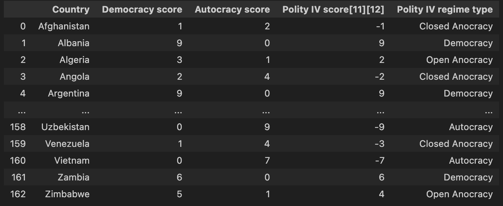

# Wiki-Scraping-Tutorial!

## Preface
Recently, I worked on an assignment that required gathering data from diverse sources on the internet. A component of that entailed collecting data from tables embedded within wikipedia articles. As a result, I thought it was a good time to write a simple tutorial on data extraction from wikipedia using the web scraping package [BeautifulSoup](https://www.crummy.com/software/BeautifulSoup/). 

### Keywords : [Web Scraping, Data Extraction ]

If you are running this in the context of a jupyter nootbook, Google Colab etc, you can install the necessary packages:

```python
%pip install bs4
%pip install requests
%pip install pandas
```

Now that our environment is prepped to the minimally sufficient degree, we can begin by using the requests package to fetch the html data and load it into a local object, so commonly named: response. All attributes of the response object can be found [here](https://requests.readthedocs.io/en/latest/api/#requests.Response), of which we will use only .text which returns the raw html tree: 

```python
import requests

url = "https://en.wikipedia.org/wiki/Polity_data_series"
response = requests.get(url)
html = response.text
print(html)
```

At this time, we want to create a BeautifulSoup object, through which we will be able to filter, find, and collect the data, directly from the html. The second argument we pass to BeautifulSoup is a choice of parser, the one we have selectec 'html.parser' comes default in any python distro.
By inspecting the html of the webpage, we are able to ascertain that there are two tables of class = wikitable, and that we desire the second. 

```python
    soup = BeautifulSoup(html, 'html.parser')
    table = soup.find_all('table', {'class': ['wikitable']})[1]  
```

Once we have correctly identified the table above, we want to begin by collecting the headers. This can be done by choosing all elements from the first 'tr' tagged element (table row) to select all elements which are in the first row. These are ostensibly the column labels, and we can store them in a seperate list for further processesing as a seperate argument into a pandas array later. 
```python
  headers = []
    header_row = table.find_all('tr')[0]
    header_cells = header_row.find_all('th')
    for th in header_cells:
        header_text = th.get_text(strip=True)  
        headers.append(header_text)  
    print("Extracted Headers:", headers)  
```

Next, collect the remainder of the data. This method exhausts the remainder of 'tr' elements in the html tree that are subsetted into the table, reading consecutive lists of data into a 2d list which comprises the data. 

```python
    data = []
    rows = table.find_all('tr')[1:]  
    for row in rows:
        cols = [td.get_text(strip=True) for td in row.find_all('td')]
        data.append(cols)

    df = pd.DataFrame(data, columns=headers)
    print(df)
```

As above, the dataframe displays properly, and we can continue on to further analysis.
